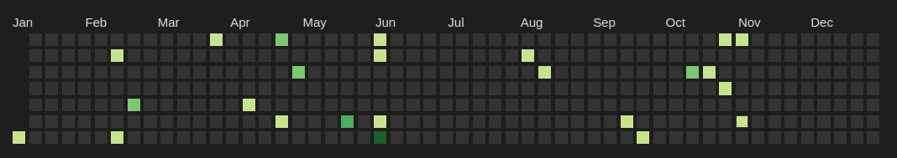

# Obsidian plugin to fetch GitHub contributions

This is a quick obsidian plugin I put together to fetch contribution statistics and store them in a local file.

## How to build

```bash
# Have npm installed and be in the root directory of this repo
npm i
npm run build
# Copy over the manifest.json and main.js to <your-vault>/.obsidian/fetch-github-contributions
```

That's it!

## How to use

You will need to set the username you want to fetch stats for in the settings. The default is `username` which at the time of me writing this isn't a valid GitHub username, so returns a 404 code.

Once you have your username set, just run the `Fetch Github Contributions: fetch` command. It will download the data and store it in a local file to be used later.

By default data gets fetched for each year starting from 2008 (the year GitHub came into existence). If you want to fetch less years, you can set the starting year in the settings. Obviously after the first fetch it should be safe to set the starting year to the current year, but the performance overhead for fetching multiple years is minimal (especially since they're fetched asynchronously).

## Where does the data go?

By default the data is stored in the `_github_data` directory in the root folder. This can be changed in the settings. Each year's statistics get stored separately in a json file in the format `2023.json`.

The data will have the following form: `{"2016-11-17":1,"2016-05-28":2}` which is basically a mapping from each day to the number of contributions that day.

## Integrating with heatmap-calendar and dataviewjs

The whole reason I created this plugin was to recreate the github contributions table in a local note which you can do by installing [Dataview](https://github.com/blacksmithgu/obsidian-dataview) and [Heatmap Calendar](https://github.com/Richardsl/heatmap-calendar-obsidian), and then using the following snippet:

````js
```dataviewjs
dv.io.load("_github_data/2023.json").then(data => {
    console.log(data)
    console.log(typeof data)
    const entries = Object.entries(JSON.parse(data)).filter(([_, value]) => value != 0).map(([date, value]) => {
        return {
            date: date,
            intensity: value
        }
    })
    renderHeatmapCalendar(this.container, {
      year: 2023,
      entries: entries,
    })
})
```
````

This produces something similar to the following:


